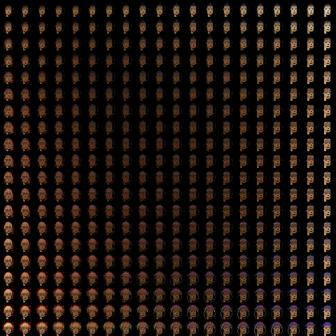

# Variational Auto-Encoder - PyTorch implementation

After reading the [Variational Auto-Encoder paper](https://arxiv.org/abs/1312.6114), I wanted to check if I could reproduce the results, so I implemented it using PyTorch (Lightning). I tried to follow the paper closely and trained on the MNIST dataset. I then thought it would be cool to learn the latent representation of [CryptoPunks](https://www.larvalabs.com/cryptopunks).

## Auto-encoding crypto punks

<p align="center">
 
    <br>
    <em>Learned manifold on the CryptoPunks dataset using a 2D latent representation.</em>
</p>

<p align="center">
 
    <br>
    <em>Left column: original sampled CryptoPunks. Right column: decoded CryptoPunks (using 20 dimensional latent representation)</em>
</p>

The crypto-punks are stored in an image containing 10,000 crypto punks with varying traits. As they are already randomly sampled, I reserve punks 1 to 6000 for the training set, 6001 to 8000 to the validation set and punk 8001 to 10000 to the test set.

For low-dimensional latent spaces (e.g. 2D), increasing the depth of the encoder and decoder by adding a hidden layer might yield better representational capabilities as opposed to augmenting the width of the hidden layer.

Furthermore, using ReLU activations and Adam optimizer (as opposed to tanh and Adagrad in the original paper) speeds up training.

For more info, see the [original paper](https://arxiv.org/abs/1312.6114) and my [notes](https://timothydelille.github.io/content/stanford_cs228_probabilistic_graphical_modeling.html#variational-auto-encoder) based on the Stanford CS228 lecture notes.

## Installation
### Install requirements
```bash
python3 -m pip install -r requirements.txt
```

### Train
You can change the parameters (dataset, number of latent variables, hidden units etc...) in the script directly.

```bash
python3 train.py
```

### Test
```bash
python3 test.py
```

### Visualize trained model
Visualize reconstructed images from the test set and the learned manifold (in the case of a 2D latent space). Saved under `./visualization_imgs`.

```bash
python3 visualizations.py
```